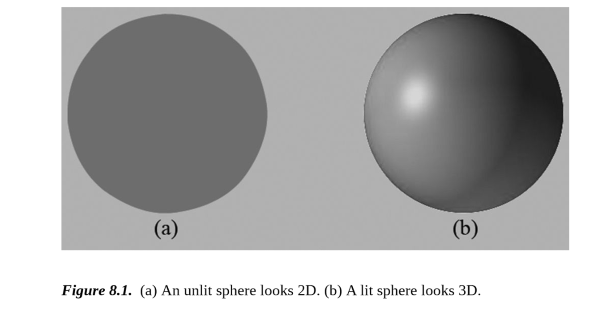
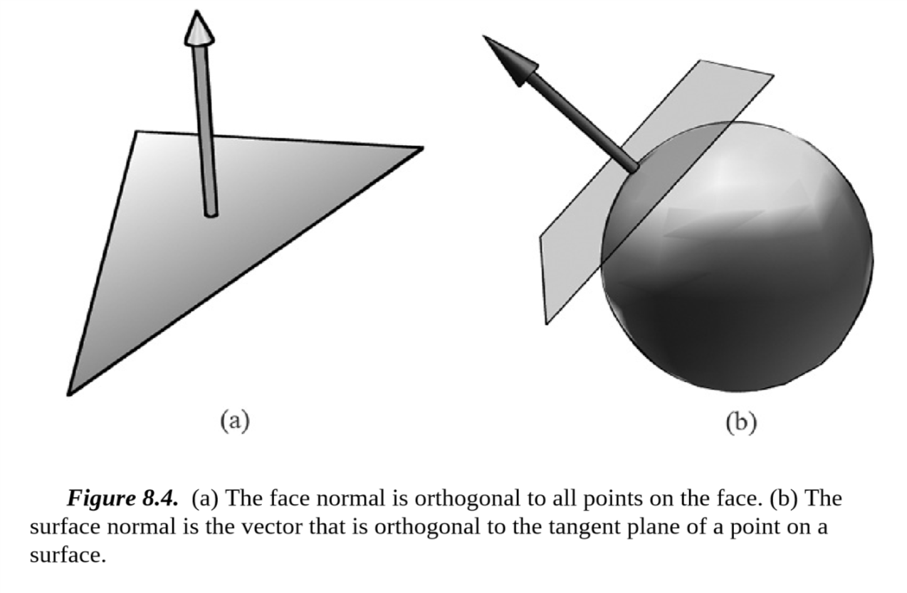
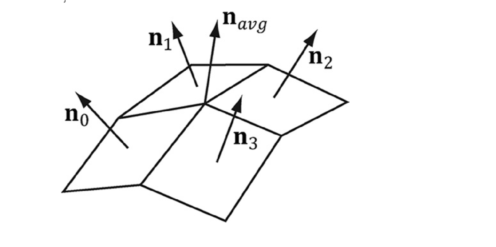
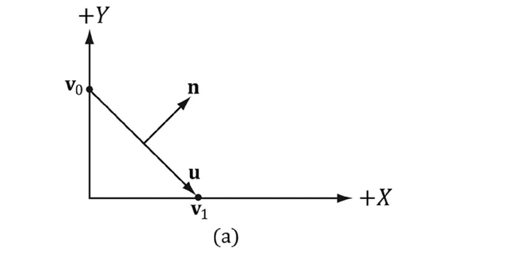
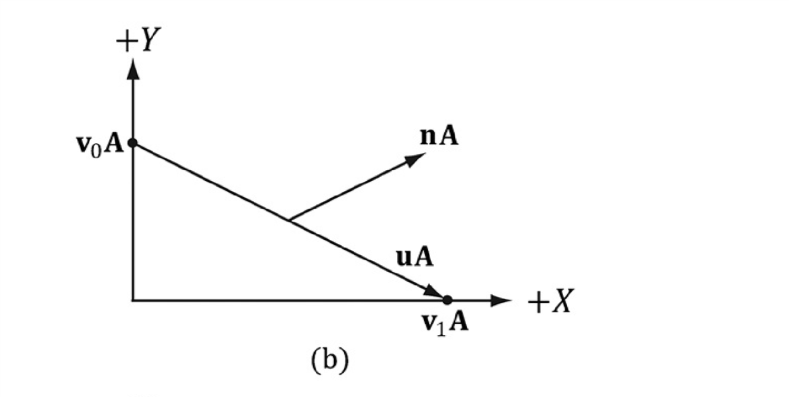
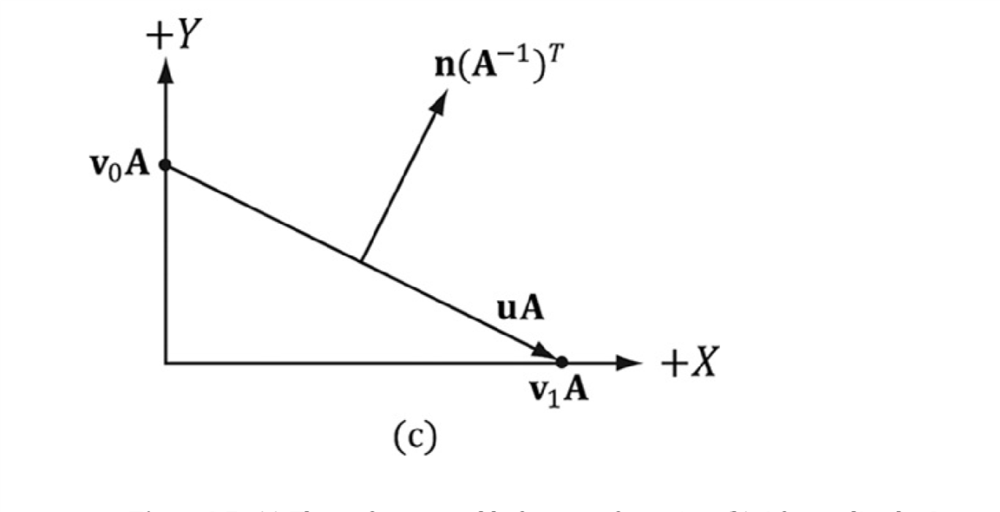
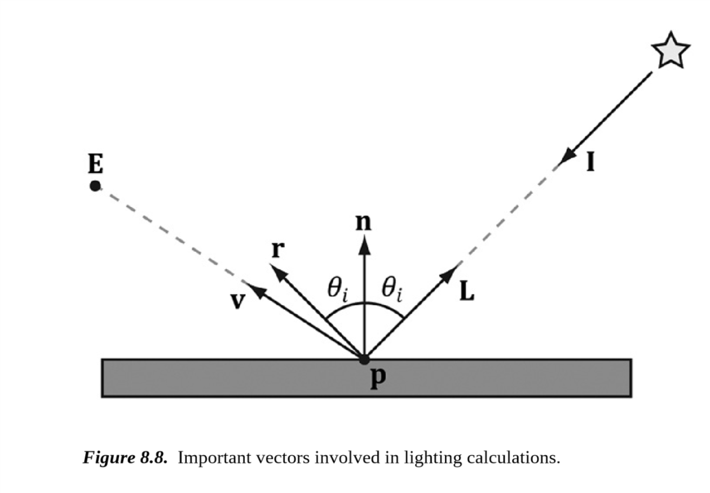

# Chapter 8 LIGHTING

观察图片[8.1](#Image8.1)，可以发现左边的球没有被光照，右边的球有光照。
就如你看到的那样，左边的球显得非常的平坦，感觉和圆基本上没啥区别。
而另外一边的球，就很有3D的感觉了——光照和阴影使得我们看到这个物体更具有体积感。
实际上，我们的视觉感知就是基于光和材质的相互作用，即光照射到物体然后射入人眼。
因此要渲染出更真实的场景的话，就必须了解和解决很多关于光照模型的问题。



当然，如果我们的光照模型越精确，那么我们的计算光照的开销就会越大。
因此我们必须要平衡好真实性和速度。
例如，电影中的3D特效场景我们就可以使用比游戏使用的更加逼真和复杂的光照模型，毕竟电影中的每一帧都是提前渲染好的，我们可以花费不止一天的时间去渲染一帧。
但是对于游戏来说，它的渲染是实时的，我们至少需要每一秒渲染30帧才能保证游戏的流畅性。

> 目标:
- 对光照和材质的相互作用有基本了解。
- 了解全局光照和局部光照的区别。
- 学会使用代数描述面上的一个点的方向(即法线)，从而我们能够确定光照到这个面的角度。
- 学会如何正确的转换法向量。
- 能够区分环境光，漫反射光以及镜面光。
- 学会如何实现平行光，点光源以及聚灯光。
- 能够通过控制衰减参数来使得光的强度能够随着深度而变化。

## 8.1 LIGHT AND MATERIAL INTERACTION

如果我们使用光照的话，我们就不需要直接指定顶点的颜色。
但是我们需要指定材质和光照，然后通过一个关于光照的方程来计算出我们顶点的颜色。
并且这样能够使得我们的物体更加的真实(对比[图片8.1](#Image8.1)中的两个球体)。

材质我们可以认为就是一种属性，来决定光照到物体的一个面的时候的作用。
例如材质就决定了光照到一个面后，哪些颜色的光会被反射，哪些颜色的光会被吸收，这个面的折射率，这个面的光滑程度以及这个面的透明程度。
通过使用材质和光照，我们可以实现各种各样的真实世界的物体的表面，例如木头，石头，玻璃，金属，水等。

在我们的光照模型中，我们的光源可以发出不同强度的红光，蓝光以及绿光。
因此，我们可以模拟出各种颜色的光。
当光从光源出发，然后射到一个物体的时候，会有一些光会被吸收，有一些会被反射(对于透明的物体来说，例如玻璃，光会穿过它。但是这里我们不讨论)。
被反射的光会改变它的方向，然后射到新的物体上，然后继续被吸收一部分，被反射一部分。
在一条光线被完全吸收之前(即没有能力继续反射)，他可能会射到过多个物体。
也有很大可能会射到人眼中去(参见[图片8.2](Image8.2))，射到视网膜上的视觉细胞上去。


通过三色理论(**trichromatic theory**)，视网膜中包含着三种不同的光线受体，分别对红光，蓝光，绿光敏感。
然后照射过来的光线会刺激对应的光线受体，然后光线受体会根据光线的强度来产生不同强度的刺激。
当光线受体接收到光后会产生神经冲动然后传向大脑，然后你的大脑就会产生对应的视觉(如果你闭上眼睛，那么光线受体就没有接收到任何光线，那么你就会看到一片黑色)。

假设在[图片8.2](#Image8.2)中，圆柱体的材质能够反射$75\%$的红光，$75\%$的绿光，然后吸收剩下的光。
球体能够反射$25\%$的红光，然后吸收所有的光。
并且我们的光源能够发出白色的光。
当我们的光源发出的光射到圆柱体的时候，所有的蓝光都会被吸收，然后只有$75\%$的红光和绿光会被反射(但是看起来的话会是黄色)。
反射的光会分散开来，一部分可能射到人眼中，一部分可能射向球体。
射向人眼的光会刺激细胞产生视觉，然后你就会看到一个黄色的圆柱体。
射向球体的光则会继续被反射，反射$25\%$的红光然后吸收其余的光。
由于经过球体的光在圆柱体反射的时候就已经被削弱了(它只反射了$75\%$)，然后球体又削弱一次，因此它看起来会比较暗淡，没有那么强烈。

我们上面介绍的光照模型我们称之为局部光照。
在局部光照中每个物体的照明都是独立的，也就是说我们在计算一个物体的光照的过程中只讨论光源直接照射到这个物体的情况。

[图片8.3](#Image8.3)介绍了局部光照，光源发出的光线本应该墙挡住，但是在图中，被墙挡住的球体仍然被视为被光照到了。


另一方面，全局光照就不仅仅只是考虑光线从光源出发直接照射到物体了，还要考虑被其他物体反射的光照射到物体的情况。
因此我们称之为全局光照，当在考虑一个物体的光照的时候，我们需要考虑整个场景的所有的物体对它的影响。
并且它虽然能够渲染出更加真实的场景，但是他的开销却非常大。

## 8.2 NORMAL VECTORS

面法线是一个描述多边形面向的方向的单位向量(**它垂直于这个多边形**)。
[图片8.4a](#Image8.4)，面法线就是一个垂直点和这个点所在的表面相切的平面的单位向量。
[图片8.4b](#Image8.4)，面法线能够决定表面上的一个点的朝向。



为了进行光照计算，我们需要知道所有的三角形网格上的每一个点的面法线，从而确定光线照射到这个点时和这个点所在的表面成的角的角度。
因此，我们会在每个顶点数据中加入一个称之为面法线的分量(**vertex normals**)。
然后我们会在光栅化阶段对顶点数据中的面法线分量进行插值，从而得到网格中所有的面上的点的法线的近似值(**显然点是无限多的，但是我们不可能去插值所有的**)。关于插值，[图片8.5](#Image8.5)介绍了插值。


简单来说我们知道起始和终止状态($p_0$和$p_1$)，然后我们对于任意的一个$p=p_0 + t(p_1 - p_0)$，那么$p$这个点的面法线就是$n = n_0 + t(n_1 - n_0)$。

如果我们在像素着色器中，通过插值得到面法线，然后进行光照计算，我们称之为逐像素光照。
我们还有一种开销相对小的，但是质量不高的方法，叫做逐顶点光照，简单来说就是对每个顶点进行光照计算，然后每个像素的值就通过插值来获得。有时候，在使用两种光照视觉效果差别不是很大的时候，我们就会经常将原本的逐像素光照换成逐顶点光照，以便于能够节约开销提高性能。

### 8.2.1 Computing Normal Vectors

计算一个三角形(**$p_0,p_1,p_2$**)的面法线，我们可以先计算出三角形的任意两条边的向量，然后得到三角形的面法线。

两条边的向量:

$$u = p_1 - p_0$$

$$v = p_2 - p_0$$

那么面法线就是:

$$n = \frac{n \times v}{|u \times v|}$$

在一个平面上，我们可以通过计算来得到一个面的法线。
但是在网格中我们要需要计算出顶点的法向量，因此我们需要一个方法。
我们假设有一个点$v$，他的法向量为$n$，那么这个点的法向量$n$就是网格中所有的包含这个顶点的多边形的面法线的平均值。例如在[图片8.6](Image8.6)，一个点被4个多边形共用，那么这个点的法向量的计算方法就是:

$$n_{avg} = \frac{n_0 + n_1 + n_2 + n_3}{|n_0 + n_1 + n_2 + n_3|}$$



在上面的式子中，我们不会对其除以4，而是直接将其标准化(**Normalize**)。
那么在更复杂的图形上，我们的计算也会变得相对简单，我们只需要将所有的面法线相加然后标准化后就可以得到一个顶点的法向量了。

```C++
    for (int i = 0; i < numTriangles; i++)
    {
        uint index0 = indices[i * 3 + 0];
        uint index1 = indices[i * 3 + 1];
        uint index2 = indices[i * 3 + 2];

        Vertex vertex0 = vertices[index0];
        Vertex vertex1 = vertices[index1];
        Vertex vertex2 = vertices[index2];

        Vector3 e0 = vertex1.pos - vertex0.pos;
        Vector3 e1 = vertex2.pos - vertex0.pos;s

        Vector3 faceNormal = Cross(e0, e1);

        vertices[index0].normal += faceNormal;
        vertices[index1].normal += faceNormal;
        vertices[index2].normal += faceNormal;
    }

    for (int i = 0; i < numVertices; i++)
        vertices[i].normal = Normalize(vertices[i].normal);
```

### 8.2.2 Transforming Normal Vectors

在[图片8.7a](Image8.7a)中，向量$u = v_1 - v_0$垂直法向量$n$。
如果我们对其进行一个非均匀的变换$A$，变换成[图片8.7b](Image8.7b)中的样子，我们会发现变换后的向量$uA = v_1A - v_0A$和变换后的$nA$并不垂直。





其中a部分是变换前，b部分是将其X轴部分缩放两个单位后，c部分是将法向量进行一次逆转变换。

也就是说，我们的问题是，一个变换矩阵$A$(**Transformation Matrix**)对一些点和对应的向量(不要求标准化)进行变换，我们需要找到另外一个矩阵$B$，使得变化后的法向量和变化后的向量垂直($uA \cdot nB = 0$)。

现在我们来推导这个矩阵:

式子 | 解释
-----| ----
$u \cdot n = 0$ | 法向量$n$垂直于这个向量$u$。
$un^T = 0$ | 将点乘写成矩阵乘法的形式。
$u(AA^{-1})n^T = 0$ | 插入一个单位矩阵$I = AA^{-1}$。
$(uA)(A^{-1}n^T) = 0$ | 矩阵乘法的结合律。
$(uA)((A^{-1}n^T)^T)^T = 0$ | 转置矩阵的性质$(M^T)^T = M$。
$(uA)(n(A^{-1})^T)^T = 0$ | 转置矩阵的性质$(AB^T)^T = B^TA^T$。
$uA \cdot n(A^{-1})^T = 0$ | 重新将矩阵乘法写成点乘法的形式。
$uA \cdot nB = 0$| 因此这样的转换就能够使得向量垂直。

因此我们只需要使用矩阵$B = (A^{-1})^T$将法向量进行变换就可以使得法向量重新垂直了。

注意如果矩阵是正交矩阵(即$A^T = A^{-1}$)那么矩阵$B$就是:

$$B = (A^{-1})^T = (A^T)^T = A$$ 。

也就是说我们并不需要对矩阵$A$进行变换，但总的来说这样的情况只是特例，我们还是需要对矩阵$A$求逆并且转置从而得到矩阵$B$。

```C++
Matrix InverseTranspose(Matrix matrix)
{
    Matrix A = matrix;
    A[3] = Vector4(0.0f, 0.0f, 0.0f, 1.0f);

    //Get the Determinant
    Matrix determinant = Matrix::Determinant(A);
    Matrix inverse = Matrix::Inverse(&determinant, A);

    return Matrix::Transpose(inverse);
}
```

由于这个变换是对向量进行变换而不是对一个点进行变换，因此我们可以将所有的平移变换清除。不过我们在3.2.1中提到过如果向量的$w$分量为$0$的话，那么平移变换对这个向量是没有任何作用的。也就是说我们并不需要将平移变换清楚也是可以的。但是如果我们要将逆矩阵的转置矩阵和一个不包含非均匀变换的矩阵$V$组合在一起的话，即变成$(A^{-1})^TV$，矩阵$(A^{-1})^T$中被转置后的关于平移的部分就会导致他们的积出现问题。因此，我们就将矩阵$A$中关于平移部分的变换清零，从而避免这样的问题。并且，如果我们要将矩阵$A$的变换和矩阵$V$的变换组合在一起的话，最好的方法还是将其先进行变换然后求逆然后转置，即$((AV)^{-1})^T$形式。

下面就是一个缩放平移矩阵以及逆转置矩阵的例子(**没有将平移部分的清零**)。

原矩阵:

$$
 A = \left[
    \begin{matrix}
    1 & 0 & 0 & 0 \\
    0 & 0.5 & 0 & 0 \\
    0 & 0 & 0.5 & 0 \\
    1 & 1 & 1 & 1
    \end{matrix}
    \right]
$$

逆转置矩阵:

$$
 (A^{-1})^T = \left[
    \begin{matrix}
    1 & 0 & 0 & -1 \\
    0 & 2 & 0 & -2 \\
    0 & 0 & 2 & -2 \\
    0 & 0 & 0 & 1
    \end{matrix}
    \right]
$$

- 注意，法向量经过逆转置矩阵的变换后他的模长可能不是单位长度，因此需要将其重新标准化。

## 8.3 IMPORTANT VECTORS IN LIGHTING

在本部分，我们将会介绍一些参与光照的重要的向量。参考[图片8.8](Image8.8)，$E$表示我们眼睛的位置，并且我们正在注视着点$p$，从点$p$指向我们的眼睛$E$的向量我们设为$v$。点$p$在的平面的法线我们设为$n$，并且点$p$被一条入射方向为向量$I$的光线照过。向量$L$则是从点$p$开始的一个和光线方向相反的单位向量。虽然我们使用向量$I$来表示光线可能较为直观，但是在这里，我们将使用向量$L$来表示。尤其是在我们计算朗伯余弦定理(**Lambert's Cosine Law**)的时候，向量$L$将会被用来计算$L \cdot n = \cos \theta_i$，其中$\theta_i$是$L$和$n$之间的角度。向量$r$则是入射光线照射到点$p$后关于这个面的法线$n$的反射向量。



反射向量$r$则为(可以参考[图片8.9](Image8.9)，我们假设$n$是单位向量):

$$r= I - 2(n \cdot I)n$$

实际上的计算我们可以使用`HLSL`内置函数`reflect`来在着色器程序中帮我们计算反射向量。

## 8.4 LAMBERT&RSQUO'S COSINE LAW