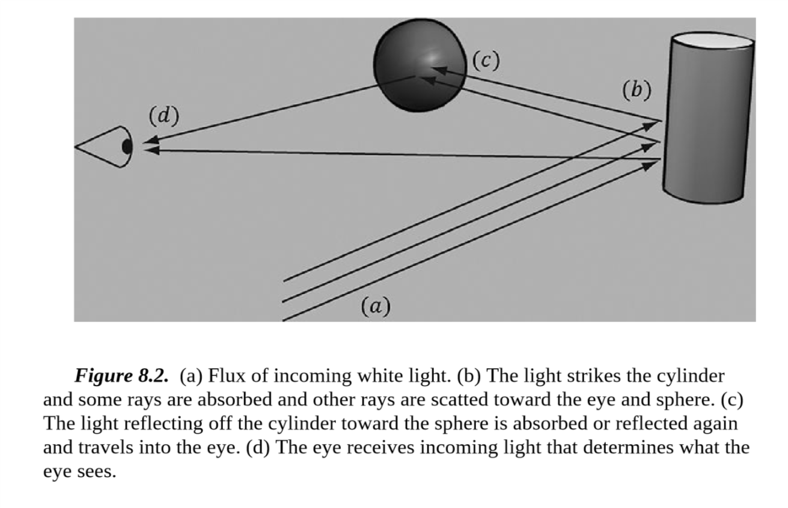

# Chapter 8 LIGHTING

观察图片[8.1](#Image8.1)，可以发现左边的球没有被光照，右边的球有光照。
就如你看到的那样，左边的球显得非常的平坦，感觉和圆基本上没啥区别。
而另外一边的球，就很有3D的感觉了——光照和阴影使得我们看到这个物体更具有体积感。
实际上，我们的视觉感知就是基于光和材质的相互作用，即光照射到物体然后射入人眼。
因此要渲染出更真实的场景的话，就必须了解和解决很多关于光照模型的问题。

当然，如果我们的光照模型越精确，那么我们的计算光照的开销就会越大。
因此我们必须要平衡好真实性和速度。
例如，电影中的3D特效场景我们就可以使用比游戏使用的更加逼真和复杂的光照模型，毕竟电影中的每一帧都是提前渲染好的，我们可以花费不止一天的时间去渲染一帧。
但是对于游戏来说，它的渲染是实时的，我们至少需要每一秒渲染30帧才能保证游戏的流畅性。

> 目标:
- 对光照和材质的相互作用有基本了解。
- 了解全局光照和局部光照的区别。
- 学会使用代数描述面上的一个点的方向(即法线)，从而我们能够确定光照到这个面的角度。
- 学会如何正确的转换法向量。
- 能够区分环境光，漫反射光以及镜面光。
- 学会如何实现平行光，点光源以及聚灯光。
- 能够通过控制衰减参数来使得光的强度能够随着深度而变化。

## 8.1 LIGHT AND MATERIAL INTERACTION

如果我们使用光照的话，我们就不需要直接指定顶点的颜色。
但是我们需要指定材质和光照，然后通过一个关于光照的方程来计算出我们顶点的颜色。
并且这样能够使得我们的物体更加的真实(对比[图片8.1](#Image8.1)中的两个球体)。

材质我们可以认为就是一种属性，来决定光照到物体的一个面的时候的作用。
例如材质就决定了光照到一个面后，哪些颜色的光会被反射，哪些颜色的光会被吸收，这个面的折射率，这个面的光滑程度以及这个面的透明程度。
通过使用材质和光照，我们可以实现各种各样的真实世界的物体的表面，例如木头，石头，玻璃，金属，水等。

在我们的光照模型中，我们的光源可以发出不同强度的红光，蓝光以及绿光。
因此，我们可以模拟出各种颜色的光。
当光从光源出发，然后射到一个物体的时候，会有一些光会被吸收，有一些会被反射(对于透明的物体来说，例如玻璃，光会穿过它。但是这里我们不讨论)。
被反射的光会改变它的方向，然后射到新的物体上，然后继续被吸收一部分，被反射一部分。
在一条光线被完全吸收之前(即没有能力继续反射)，他可能会射到过多个物体。
也有很大可能会射到人眼中去(参见[图片8.2](Image8.2))，射到视网膜上的视觉细胞上去。

通过三色理论(**trichromatic theory**)，视网膜中包含着三种不同的光线受体，分别对红光，蓝光，绿光敏感。
然后照射过来的光线会刺激对应的光线受体，然后光线受体会根据光线的强度来产生不同强度的刺激。